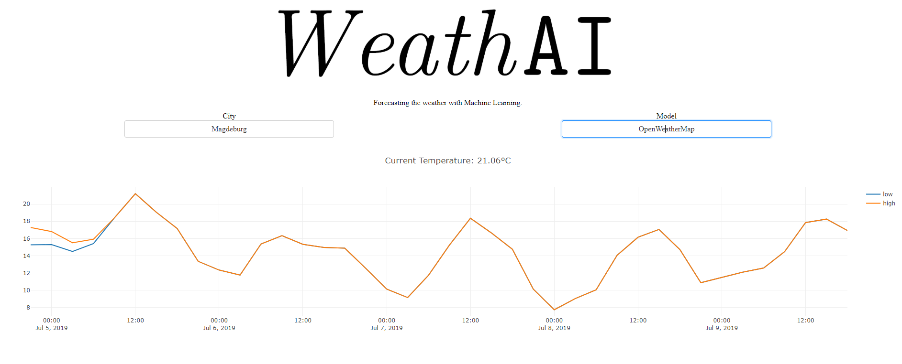
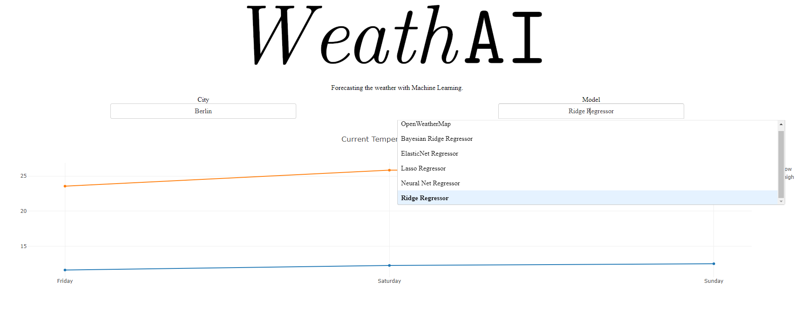

# 

Weather web-app for making temperature forecasts using machine learning models or the [OpenWeather](https://openweathermap.org/) forecast.

### Currently supported cities:
* Berlin
* Hamburg
* Magdeburg
* Munich

### Currently supported models:
* [Bayesian Regression](https://scikit-learn.org/stable/modules/linear_model.html#bayesian-regression)
* [Elastic-Net](https://scikit-learn.org/stable/modules/linear_model.html#elastic-net)
* [Lasso](https://scikit-learn.org/stable/modules/linear_model.html#lasso)
* [Neural Network Regression](https://scikit-learn.org/stable/modules/generated/sklearn.neural_network.MLPRegressor.html#sklearn-neural-network-mlpregressor)
* [Ridge Regression](https://scikit-learn.org/stable/modules/linear_model.html#ridge-regression)

The weather data source is [Deutscher Wetterdienst](https://www.dwd.de).

### Use of the App:

For using the app a valid API key form [OpenWeather](https://openweathermap.org/appid) is required. Enter this key as a string as user_key in the document App.py.

### How it should look:

With everything set up the app should look as follows:

(OpenWeather selected as model)

(Open model selection)
